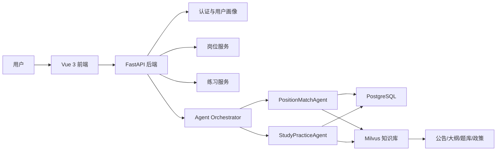

# 架构设计

## Agent 调度

- 用户问岗位、报名条件、职位推荐时进入 `PositionMatchAgent`。
- 用户问备考、题目、申论、面试时进入 `StudyPracticeAgent`。
- 无法判断时先问澄清问题。

## 数据分层

- 结构化数据：用户画像、职位表、匹配报告、练习记录存 PostgreSQL。
- 非结构化数据：公告、政策、大纲、题库解析存 Milvus。
